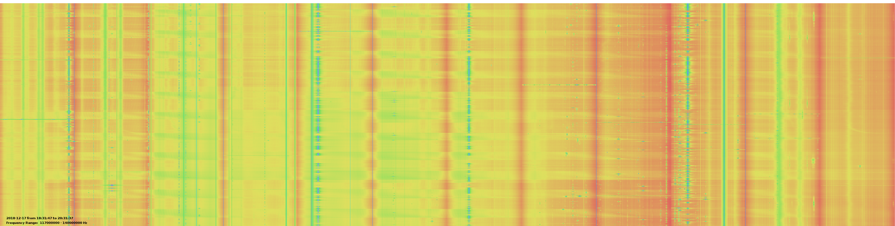

# Heatmap 

Software for creating a heatmap from [`rtl_power`](https://github.com/keenerd/rtl-sdr) csv data. 

## Usage:

git clone https://github.com/gue-ni/heatmap.git  
cd build  
java -jar RadioHeatmap.jar -f file -i image -t filetype  
java -jar RadioHeatmap.jar --help  

## TODO:
Improve labeling.  
Enable processing of very large files.  

